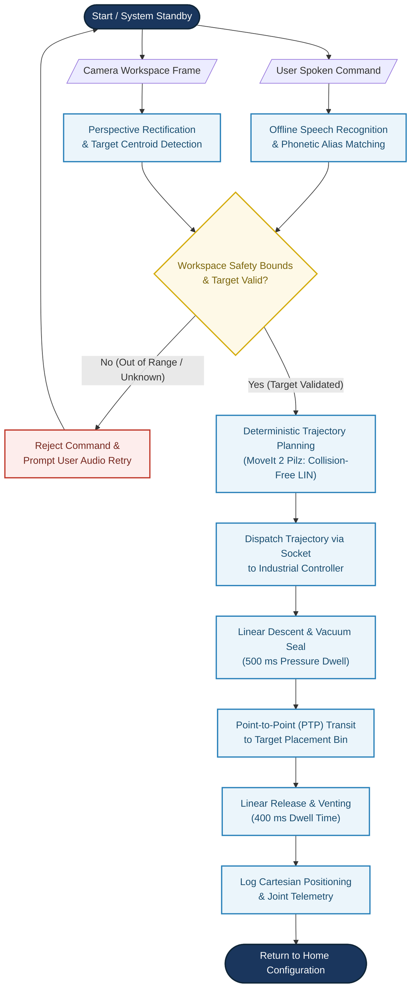

# 🤖 Deterministic Multimodal Manipulation: Simplified Flowchart & Architecture Guide

Dokumen ini memuat **diagram alur (*flowchart*) dan arsitektur sistem yang telah disederhanakan (*streamlined & publication-ready*)** untuk naskah jurnal/konferensi internasional. Seluruh diagram dirancang agar **bebas dari keterikatan merek (*brand-agnostic*)**, memiliki keterbacaan tinggi (*high readability*), dan pas disisipkan ke dalam format satu kolom naskah ilmiah (Word / LaTeX Springer).

---

## 📑 Daftar Isi
1. [Perbandingan: Mengapa Diagram Lama Perlu Disederhanakan?](#1-perbandingan-mengapa-diagram-lama-perlu-disederhanakan)
2. [Flowchart Opsi A: Arsitektur Modular 4-Pilar Horizontal (Rekomendasi Utama Fig. 1)](#2-flowchart-opsi-a-arsitektur-modular-4-pilar-horizontal)
3. [Flowchart Opsi B: Alur Keputusan Operasional (Sequential Decision-Tree)](#3-flowchart-opsi-b-alur-keputusan-operasional-sequential-decision-tree)
4. [Tabel Pemetaan Komponen & Komunikasi](#4-tabel-pemetaan-komponen--komunikasi)
5. [Panduan Ekspor ke Word & Resolusi Tinggi (300 DPI)](#5-panduan-ekspor-ke-word--resolusi-tinggi-300-dpi)

---

## 1. Perbandingan: Mengapa Diagram Lama Perlu Disederhanakan?

| Parameter | Versi Lama (`figure1_Flowchart.png`) | Versi Sederhana Baru (Dokumen Ini) |
| :--- | :--- | :--- |
| **Dimensi & Rasio** | Sangat panjang vertikal (8.192 × 3.284 px, rasio 2.5:1) | Seimbang horizontal (16:9 atau 4:3), pas 1 lebar kolom Word |
| **Keterbacaan Teks** | Huruf menjadi sangat kecil saat diperkecil ke lebar kertas | Font besar, tebal (*bold*), dan langsung terbaca jelas |
| **Keterikatan Merek** | Menyebutkan KUKA, KRC4, ros_eki, Port 54600 | **Generalis**: *Industrial Manipulator*, *Network Socket Bridge* |
| **Beban Detail** | Terlalu banyak node internal (CSV logger, dummy_changer) | Fokus pada alur kerja ilmiah esensial (Input $\to$ Visi/Suara $\to$ Gerak $\to$ Robot) |

---

## 2. Flowchart Opsi A: Arsitektur Modular 4-Pilar Horizontal

> **Rekomendasi Terbaik untuk Gambar 1 (*Figure 1*) Paper**:  
> Menyajikan pemisahan modular antara persepsi, perencanaan lintasan, dan eksekusi fisik tanpa ketergantungan pada model komputasi berat.

```mermaid
flowchart LR
    %% Styling Classes
    classDef input fill:#EBF5FB,stroke:#2980B9,stroke-width:2px,color:#1B4F72;
    classDef perceive fill:#E8F8F5,stroke:#16A085,stroke-width:2px,color:#0E6251;
    classDef plan fill:#FEF9E7,stroke:#D4AC0D,stroke-width:2px,color:#7D6608;
    classDef hw fill:#FDEDEC,stroke:#C0392B,stroke-width:2px,color:#78281F;

    subgraph S1 ["1. Multimodal Human Input"]
        MIC["🎤 Directional Microphone<br/>(16 kHz Spoken Audio)"]
        CAM["📷 Overhead RGB Camera<br/>(Live Workspace Frame)"]
    end

    subgraph S2 ["2. Deterministic Perception"]
        ASR["Offline Speech Decoder<br/>(Vosk Engine + Phonetic Map)"]
        VIS["Perspective Calibration<br/>(12-ArUco Planar Homography)"]
        MIC -->|"Audio Stream"| ASR
        CAM -->|"Video Frame"| VIS
    end

    subgraph S3 ["3. Orchestration & Planning"]
        COORD["Task Coordinator<br/>& Safety Bounds Validator"]
        MOVEIT["MoveIt 2 Motion Engine<br/>(Pilz Industrial Planner: LIN / PTP)"]
        ASR -->|"Target Class"| COORD
        VIS -->|"Cartesian XYZ"| COORD
        COORD -->|"Task Request"| MOVEIT
    end

    subgraph S4 ["4. Physical Execution"]
        BRIDGE["Network Socket Bridge<br/>(Standard Protocol Link)"]
        CTRL["Industrial Robot Controller<br/>& 6-Axis Manipulator"]
        VAC["Vacuum Gripper End-Effector<br/>(Pneumatic Dwell Control)"]
        MOVEIT -->|"Trajectory Waypoints"| BRIDGE
        BRIDGE <-->|"Closed-Loop Feedback"| CTRL
        CTRL -->|"Actuation"| VAC
    end

    class MIC,CAM input;
    class ASR,VIS perceive;
    class COORD,MOVEIT plan;
    class BRIDGE,CTRL,VAC hw;
```

---

## 3. Flowchart Opsi B: Alur Keputusan Operasional (Sequential Decision-Tree)

> **Rekomendasi untuk Menjelaskan Logika Penanganan Material / Alat Medis**:  
> Menggambarkan diagram alur sekuensial langkah demi langkah dari deteksi perintah hingga pencatatan evaluasi dan penanganan kesalahan.

---

## 4. Tabel Pemetaan Komponen & Komunikasi

| Lapisan (*Layer*) | Komponen Utama | Protokol / Antarmuka | Fungsi Utama |
| :--- | :--- | :--- | :--- |
| **1. Input** | Mikrofon & Kamera RGB | PCM 16 kHz & Raw Video | Menangkap suara operator tanpa kontak fisik dan citra meja kerja. |
| **2. Persepsi** | Vosk ASR + Homografi 12-ArUco | ROS 2 Topics (`/voice_command`) | Mendekode kata target secara luring dan memetakan piksel ke $(X,Y,Z)$ dunia. |
| **3. Perencanaan** | MoveIt 2 + Pilz Planner | ROS 2 Action (`/move_action`) | Menghasilkan trajektori garis lurus (LIN) yang deterministik bebas tabrakan. |
| **4. Eksekusi** | Soket Jaringan & Manipulator | TCP/IP Soket Standar (20 Hz) | Mengirim *waypoint* ke kontroler industri dan mengaktifkan hisap vakum. |

---

## 5. Panduan Ekspor ke Word & Resolusi Tinggi (300 DPI)

1. **Pratinjau (*Preview*) di VS Code / Markdown**:
   * Pasang ekstensi **Markdown Preview Mermaid Support** di VS Code untuk melihat diagram interaktif secara langsung.
2. **Ekspor Gambar ke Format Jurnal**:
   * Salin kode Mermaid di atas ke [Mermaid Live Editor](https://mermaid.live).
   * Klik menu **Actions** $\to$ Pilih **Download PNG (Resolusi Tinggi)** atau **Download SVG**.
   * Sisipkan ke dalam dokumen Word `splnproc1703.docm` sebagai **Fig. 1**.
